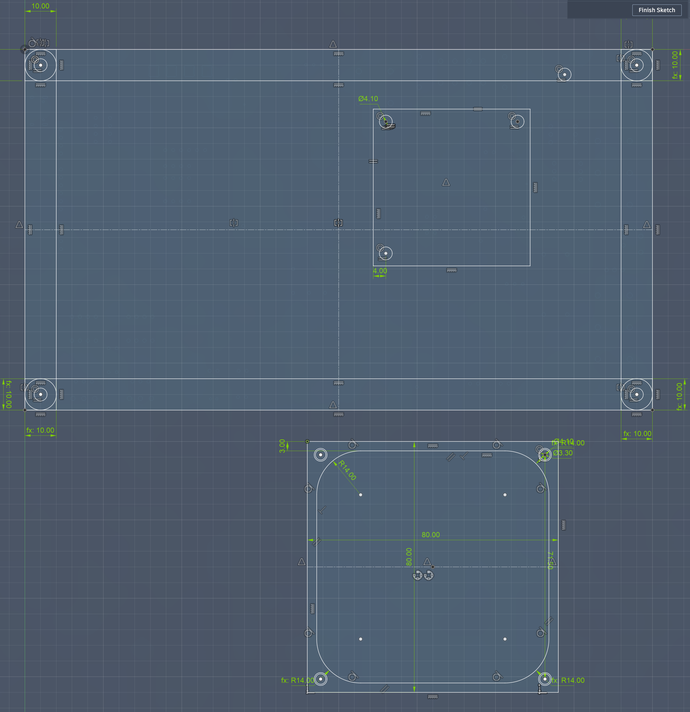
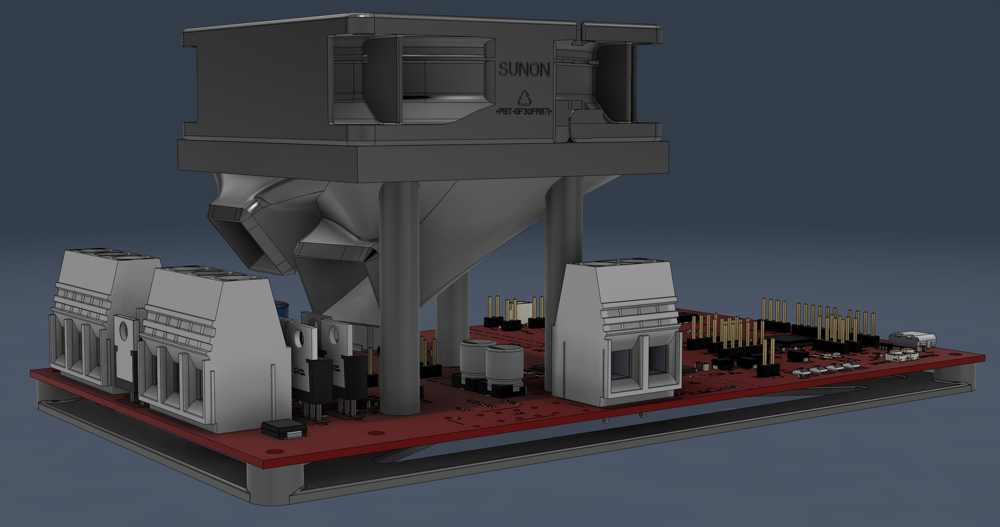
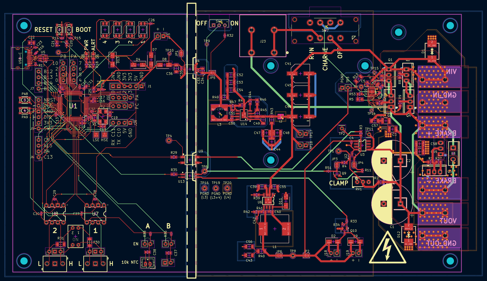

# The Clampinator

Inspired by the [ODrive Regen Clamp](https://shop.odriverobotics.com/products/odrive-regeneration-clamp), the clampinator is a custom built regeneration clamp targeting 16-60V systems.

## Key Features
 - 16-60V input
 - Adjustable clamp voltage via trimpot
 - Full reverse current protection via TI's [LM7481-Q1](https://www.ti.com/product/LM7481-Q1)
   - Ideal diode inrush current limiting supported, but marked as DNP
 - External pre-charge resistor
 - **FULL galvanic isolation between power and logic domains**
 - USB-C port for programming
 - STM32H5 based logic control
   - Digital control to disconnect power input from output
   - 2x CAN FD exposed w/toggleable termination resistors
 - Two onboard LEDs (Yellow and RGB)
 - Two 10k thermistor slots for thermistors
 - Two 15V outputs for active cooling fans

> [!CAUTION]
> The Clampinator must not be plugged in unless the power switch is off. To turn on, slide power switch to `PRECHARGE`, and only proceed to `RUN` after allowing at least 1s for the bulk capacitors to charge.

## Using the CAN bus

The STM32 on the board is equipped with two built in CAN FD controllers, and the Clampinator has two accompanying CAN transcievers in the bottom left of the board. There is dip switch `SW5` which can be used to toggle the internal 120Ω termination resistors.

## Building the Clampinator
The Clampinator can be ordered from sites like JLCPCB. The KiCAD source files are in `./KiCAD` and the production gerber files are in `./KiCAD/prod` along with the bom.

## Images 

  
 
 

## Schematic

### Main Circuit

## Logic Side Circuit

## Thermal Management

## BOM

| **Name**              | **Purpose**                                     | **Quantity** | **Total Cost (USD)** | **Link**                                                                                                                      | **Distributor**   |
|-----------------------|-------------------------------------------------|--------------|----------------------|-------------------------------------------------------------------------------------------------------------------------------|-------------------|
| LCSC Parts            | Majority of PCB Components (With GSDL selected) |              | 124.28               |                                                                                                                               | LCSC              |
| 150R 25W Resistor     | Precharge Resistor (Inrush Current Limiting)    | 1            | 5.19                 | https://www.digikey.com/en/products/detail/riedon-products-by-bourns/UAL25-150RF8/3886469                                     | DigiKey           |
| 1818-VP036584000AG-ND | Connect Main Power                              | 2            | 5.50                 | https://www.digikey.com/en/products/detail/amphenol-anytek/VP036584000AG/10378245                                             | DigiKey           |
| 1818-VP0265840000G-ND | Connect Precharge Resistor                      | 1            | 3.10                 | https://www.digikey.com/en/products/detail/amphenol-anytek/VP0265840000G/10378270                                             | DigiKey           |
| EG1847-ND             | Switch for Logic Side of Board                  |              | 0.89                 | https://www.digikey.com/en/products/detail/e-switch/EG1270/6076                                                               | DigiKey           |
| 259-1805-ND           | Active Cooling Fan (price includes est. tariff) | 2            | 15.48                | https://www.digikey.com/en/products/detail/sunon-fans/MF80252V1-1000U-A99/6198743                                             | DigiKey           |
| SW115-ND              | (GPI-154-3013) Precharge Switch                 |              | 1.83                 | https://www.digikey.com/en/products/detail/cw-industries/GPI-154-3013/902                                                     | DigiKey           |
| 1.6R 500W Resistor    | Main brake resistor                             |              | 29.99                | https://www.youdaelectronics.com/products/1pc-500w-watt-16-ohm-500w-16r-aluminum-housing-wire-wound-resistor-29x52x250mm-3199 | Youda Electronics |
| JLCPCB + Stencil      | Main Clampinator Board                          | 1            | 101.38               |                                                                                                                               | JLCPCB            |

